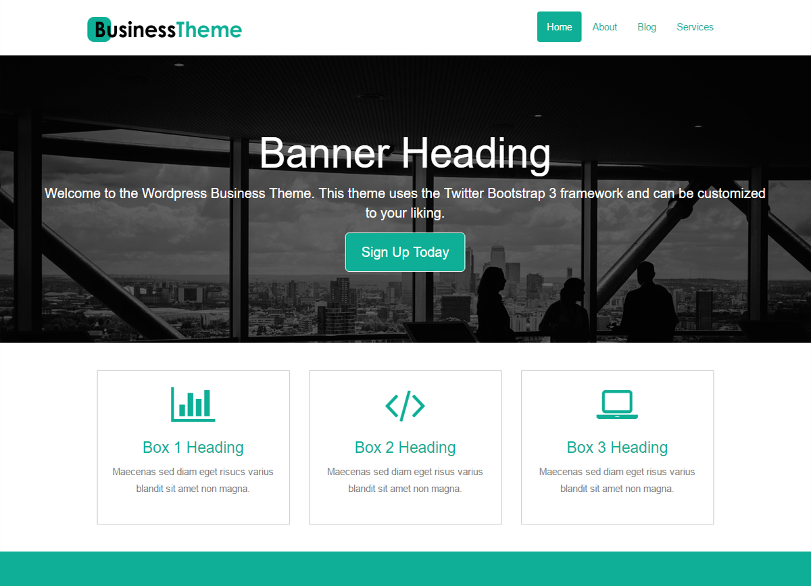
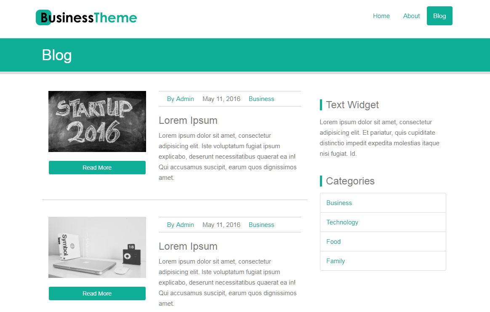

###### This theme was built with Bootstrap Framework 

# Includes
* Custom Home Page
  * Showcase Widget Banner
  * Three Service Boxes
  * Middle Banner
  * Features List
  * Footer
* Blog
  * Title, Description, and Image and meta data 
  * Text Widget
  * Category Widget
  
 
 
 
 
## How to Use
In order to use this WordPress theme, you have to:
1. Download this folder and all files. 
2. Place the folder inside the "themes" folder, which is inside "wp-content" folder in your WordPress directory.
3. Once you have moved the theme to the correct folder, go to your WordPress admin page and log in.
4. Go to Appearance, then Themes.
5. Find the Theme called "BusinessTheme" and click Activate.
