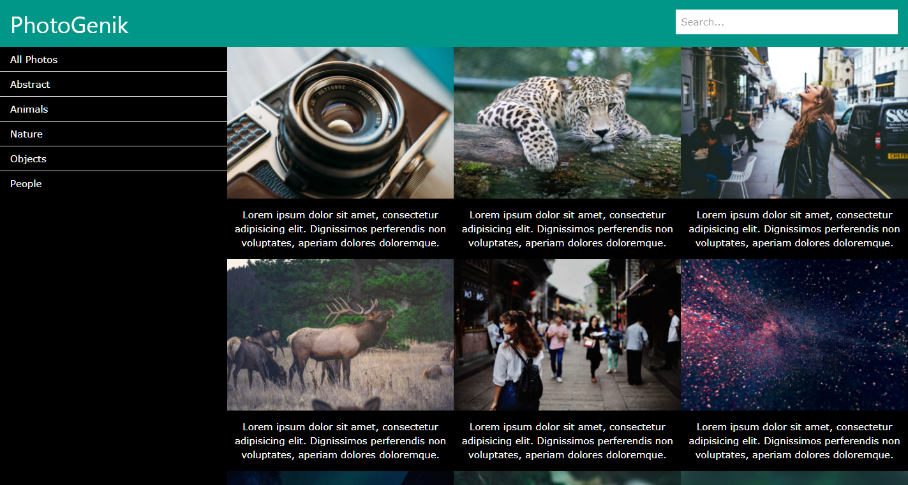

###### This is a Photo Gallery WordPress Theme

# Includes
* Photo Gallery
  * WordPress Search Engine
  * SideBar (used for categories widget)
  * Each Photo Post includes picture and text
  * W3.css Animations and Grid
* Post Pages (one per Photo Post)
  * W3.css Animation
  * Meta data about the picture
  * Photo Title and Description
  * Back Button

## Screenshot

### How to Use
In order to use this WordPress theme, you have to:
1. Download this folder and all files. 
2. Place the folder inside the "themes" folder, which is inside "wp-content" folder in your WordPress directory.
3. Once you have moved the theme to the correct folder, go to your WordPress admin page and log in.
4. Go to Appearance, then Themes.
5. Find the Theme called "PhotoGenik" and click Activate.
