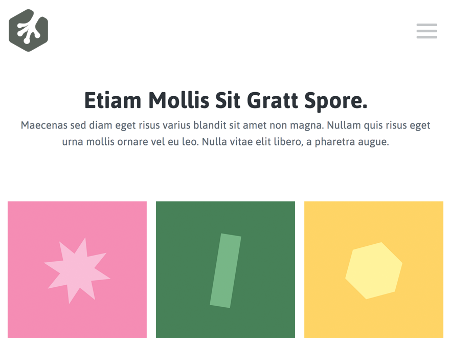

###### This is a WordPress Theme created by following the Treehouse Course on WordPress Theme Development using Foundation Framework and Google Fonts

# Includes
* Home
  * Welcome text
  * Latest four portfolio posts
* Portfolio (custom post type)
  * Full list of Portfolio type posts
  * Each Portfolio Post has title, description, images, Next, Previous, and Back buttons 
* Blog
  * Sidebar with widgets on the left side (custom template)
  * List of blog posts with title, excerpt, meta data and featured image
* Other pages
  * Either full width page or custom template page with sidebar
  
## Screenshot

