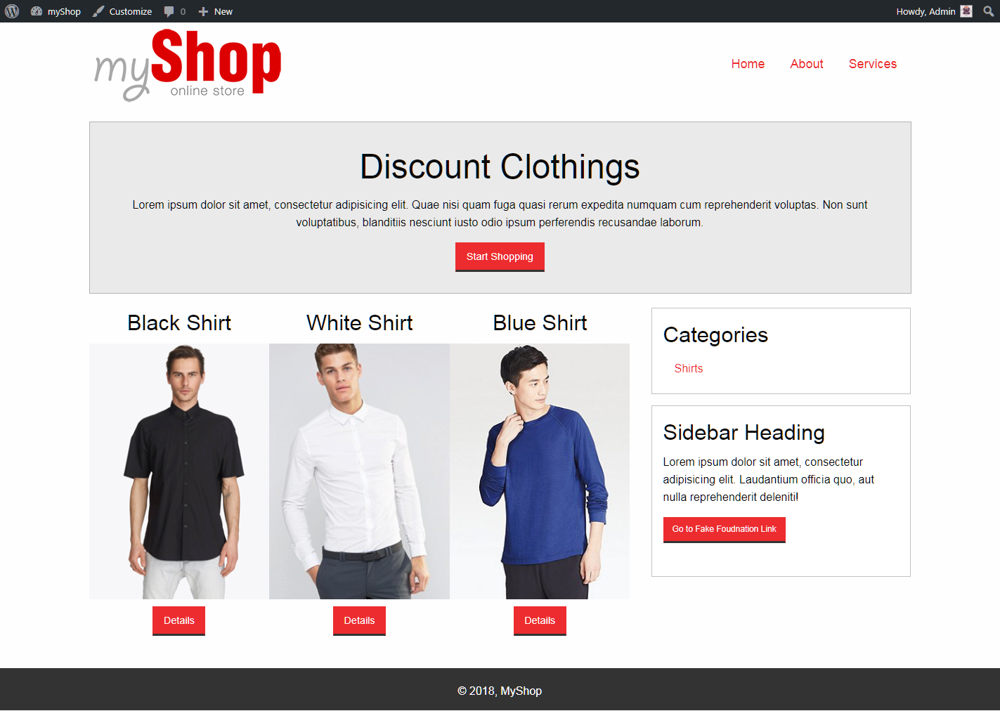
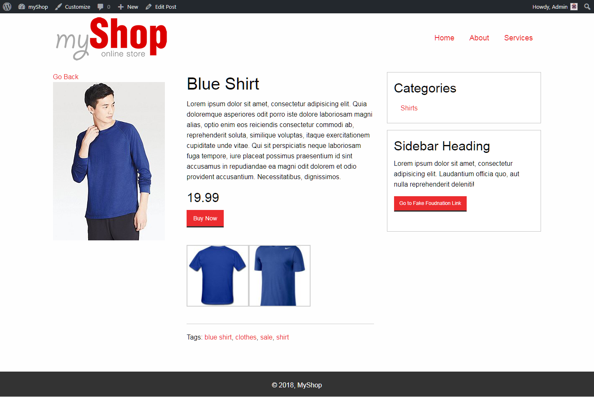

###### This theme requires the Showcase Widget made by me and the Foundation Framework (included in the folders)

# Includes
* Custom Home Page
  * Showcase Widget (Discount Clothing)
  * Products
  * SideBar
* Single Product Page
  * Featured Image
  * Title, Description, and Price 
  * Gallery
  * SideBar
  * Tags
  
 
 
 
 
## How to Use
In order to use this WordPress theme, you have to:
1. Download this folder and all files. 
2. Place the folder inside the "themes" folder, which is inside "wp-content" folder in your WordPress directory.
3. Once you have moved the theme to the correct folder, go to your WordPress admin page and log in.
4. Go to Appearance, then Themes.
5. Find the Theme called "myShop" and click Activate.
6. Copy and Paste the folder "showcase-widget" inside your plugins folder (found in wp-content)
